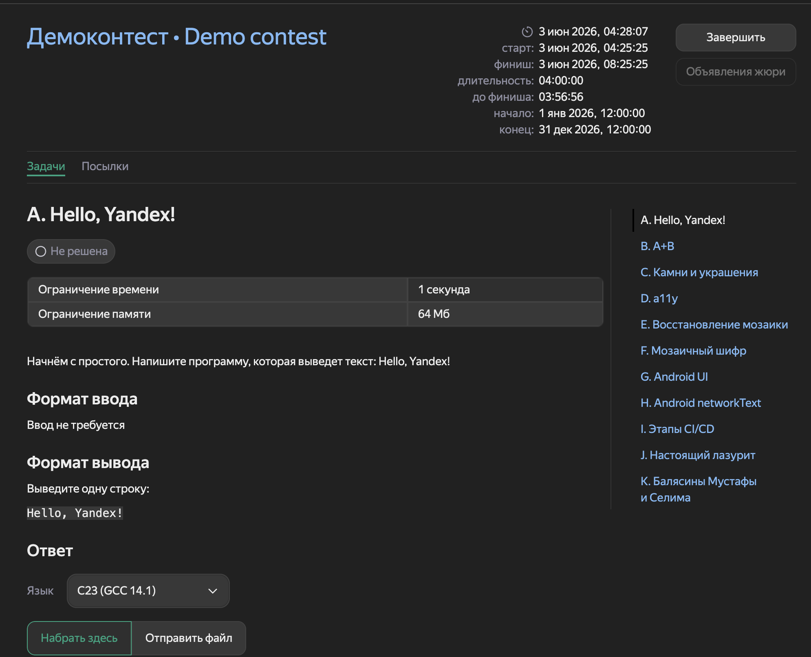
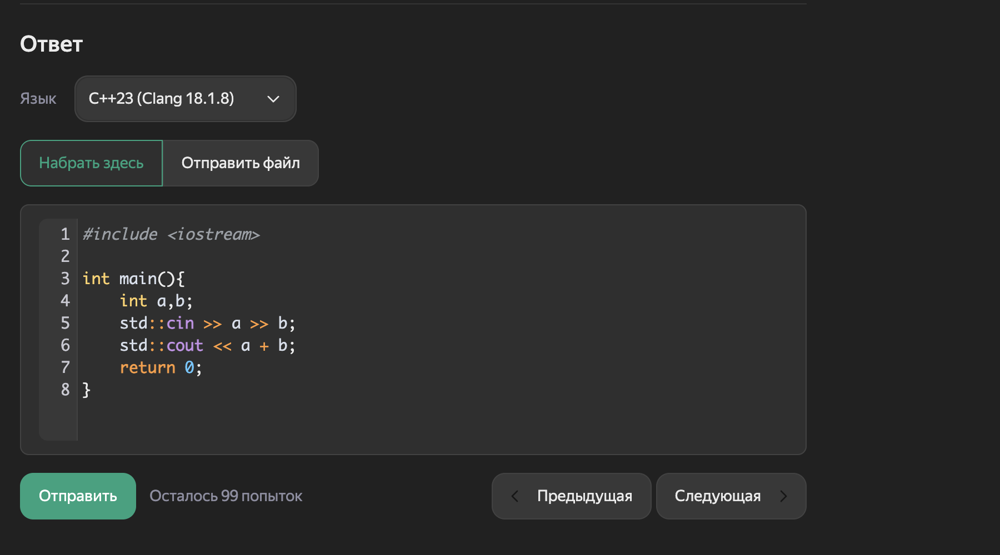
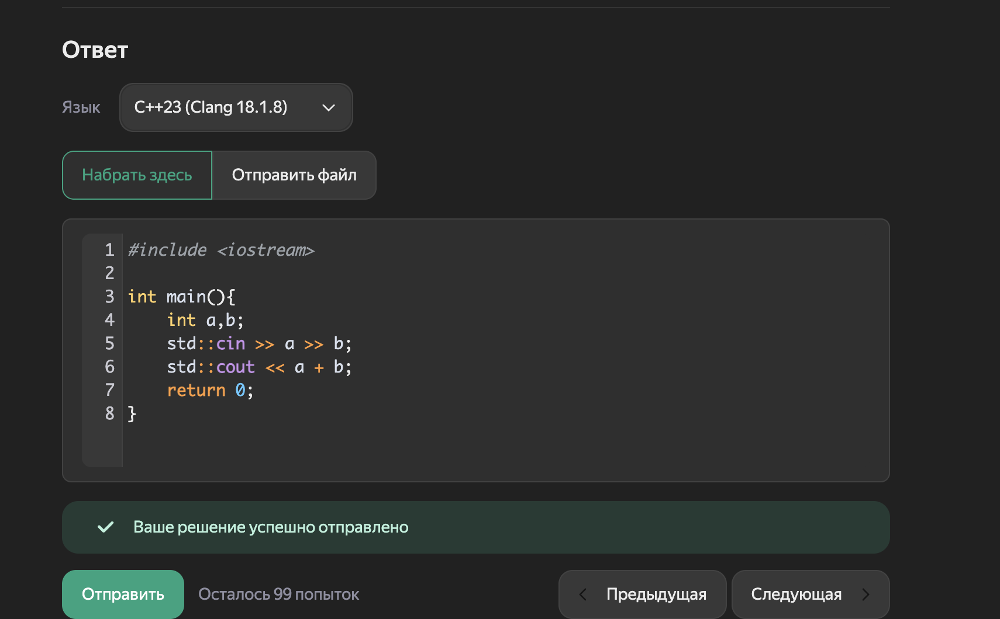
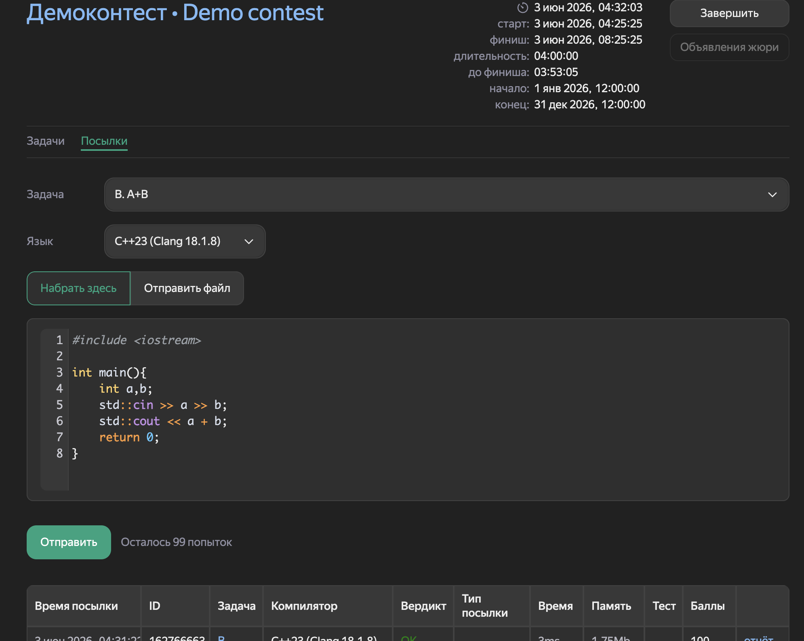

# Yandex Contest Enhancer

A small Chrome extension that improves the Yandex Contest interface with a dark theme, syntax highlighting, and cleaner UI for everyday competitive programming.

It is built as a lightweight content-script extension: no backend, no account, no tracking.

## Features

- Dark mode for Yandex Contest pages.
- Floating theme toggle button.
- IDE-like syntax highlighting in the solution editor.
- Cleaner problem statement layout.
- Improved sample input/output blocks.
- Better contrast for verdicts, status tags, messages, buttons, and tables.
- Dark styling for submissions and run report pages.
- More readable standings table.

## Why

Yandex Contest is useful, but the default interface can feel harsh during long practice sessions, especially at night. This extension keeps the original workflow intact and focuses on making the page easier to read and more comfortable to use.

## Screenshots

Screenshots are from the Yandex Contest demo contest with the extension enabled.

### Problem Page



### Code Editor



### Submission Feedback



### Submissions Page



## Installation

1. Clone or download this repository.
2. Open `chrome://extensions` in Chrome.
3. Enable `Developer mode`.
4. Click `Load unpacked`.
5. Select the project folder.
6. Open any `contest.yandex.ru/contest/...` page.

## Usage

The dark theme is enabled by default. Use the round button in the bottom-right corner of the page to turn it on or off.

The extension saves the theme preference in `localStorage` for the current browser profile.

## Project Structure

```text
.
├── manifest.json          # Chrome extension manifest
├── content.js             # Theme toggle and page markers
├── code-highlighter.js    # CodeMirror syntax highlighting mode
├── styles.css             # Dark theme and UI overrides
├── screenshots/           # README screenshots
└── README.md
```

## Notes

- The extension targets `https://contest.yandex.ru/contest/*` pages.
- Syntax highlighting depends on the editor used by Yandex Contest. The extension adds a custom CodeMirror mode when CodeMirror is available.
- Some Yandex Contest UI blocks are rendered dynamically, so the extension uses a small `MutationObserver` to restyle new elements.

## Contributing

Issues and pull requests are welcome. If you notice a broken page state, attach a screenshot and the page type, for example: problem page, submissions page, standings page, or run report page.

## License

No license has been selected yet.
